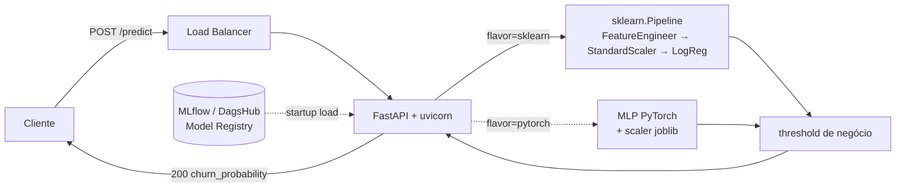

# fiap-mlet-challenge-fase-1

[](https://app.codecov.io/gh/JosueJNLui/fiap-mlet-challenge-fase-1)

Previsão de churn de clientes com base no dataset Telco Customer Churn. API REST em FastAPI servindo, por padrão, a **Logistic Regression (sklearn)** registrada no MLflow do DagsHub. O **MLP (PyTorch)** fica versionado como alternativa A/B-testável, selecionável via `MODEL_FLAVOR=pytorch` no `.env` (ver [`docs/MODEL_CARD.md`](docs/MODEL_CARD.md) §7.1).

## Links rápidos

- 🎥 **Vídeo de apresentação (STAR):** <https://www.youtube.com/watch?v=30s7Az1HCok>
- 🚀 **API em produção (AWS):** <http://fiap-mlet-1033987737.us-east-1.elb.amazonaws.com>
  - Swagger UI: <http://fiap-mlet-1033987737.us-east-1.elb.amazonaws.com/docs>
  - ReDoc: <http://fiap-mlet-1033987737.us-east-1.elb.amazonaws.com/redoc>

## Arquitetura do sistema

API estruturada em camadas (DDD enxuto):

- **`src/api/`** (Interface): rotas FastAPI (`/health`, `/predict`), schemas Pydantic, dependências.
- **`src/application/`** (Casos de uso): `FeatureEngineer` (transformador `BaseEstimator/TransformerMixin`), `build_logreg_pipeline()` (sklearn `Pipeline` reprodutível), `ChurnPredictor` (modo Pipeline ou modo componentes), schemas pandera (`data_schemas.py`) e métricas de negócio.
- **`src/infrastructure/`** (Integrações externas): loader que busca o modelo registrado no MLflow do DagsHub. No flavor `sklearn` (default), carrega a `sklearn.Pipeline` empacotada (FeatureEngineer + StandardScaler + LogReg) como artefato único. No flavor `pytorch`, carrega o MLP e baixa `scaler.joblib` do mesmo run.
- **`src/main.py`** (Composição): `create_app()`, lifespan que carrega o modelo no startup (fail-fast), middleware de latência + logging JSON estruturado com `request_id` propagado, métricas Prometheus expostas em `/metrics`.

Fluxo de uma predição:
1. Lifespan carrega o modelo (default: `Churn_LogReg_Final_Production` Pipeline empacotada; alternativo: `Churn_MLP_Final_Production` + scaler) na versão pinada → `app.state.predictor`.
2. Cliente faz `POST /predict` com payload Telco bruto (21 campos menos `customerID`).
3. Pydantic valida enums e ranges (422 em caso de erro).
4. `ChurnPredictor.predict()`:
   - **sklearn (default):** `pipeline.predict_proba(payload)`. A Pipeline interna executa FeatureEngineer → StandardScaler → LogReg; nenhum preprocessing manual no caminho de inferência.
   - **pytorch (alternativo):** `preprocess_one` → `scaler.transform` → tensor PyTorch + sigmoid.
   - Em ambos: comparação com threshold de negócio (default `0.2080` para LogReg; `0.20303` para o MLP, otimizados na mesma curva de lucro).
5. Resposta inclui `churn_probability`, `prediction`, `threshold`, `model_version`, `request_id`.



📚 **Documentação operacional:**
- [`docs/MODEL_CARD.md`](docs/MODEL_CARD.md): performance, vieses, limitações, cenários de falha.
- [`docs/ARCHITECTURE_DEPLOY.md`](docs/ARCHITECTURE_DEPLOY.md): decisão real-time, SLA, scaling, DR.
- [`docs/DEPLOYMENT.md`](docs/DEPLOYMENT.md): arquitetura prática de deploy com Helm/Kubernetes e Terraform/AWS ECS.
- [`docs/MONITORING.md`](docs/MONITORING.md): métricas técnicas/modelo/negócio, alertas, playbook.
- [`docs/CONTRIBUTING.md`](docs/CONTRIBUTING.md): fluxo TBD, Conventional Commits, SemVer.
- [`docs/CODE_GUIDELINES.md`](docs/CODE_GUIDELINES.md): diretrizes de DDD, Clean Code e stack Python.

🧪 **Notebooks de pesquisa** (FIAP MLET Fase 1):
- `notebooks/eda.ipynb` cobre a **Etapa 1** (EDA + baselines DummyClassifier/Logistic Regression) e escreve no experimento MLflow `Churn-Predict-Telco-Etapa1-EDA`.
- `notebooks/modeling.ipynb` cobre a **Etapa 2** (MLP em PyTorch + ensembles, grid search, K-Fold, threshold otimizado, análise de trade-off FP×FN) e escreve em `Churn-Predict-Telco-Etapa2-Modelagem`.
- `notebooks/models-comparison.ipynb` consulta os **dois** experimentos para a comparação cruzada.
- Cálculos de lucro e custo de erro vivem em [`src/application/business_metrics.py`](src/application/business_metrics.py), fonte única da verdade compartilhada pelos três notebooks e pelo Model Card.

## Documentação interativa (Swagger / OpenAPI)

Com a API rodando, abra um dos endpoints abaixo no browser:

| Local | Produção (AWS) | Descrição |
|---|---|---|
| <http://localhost:8000/docs> | <http://fiap-mlet-1033987737.us-east-1.elb.amazonaws.com/docs> | Swagger UI: testar endpoints direto do browser (`Try it out`) |
| <http://localhost:8000/redoc> | <http://fiap-mlet-1033987737.us-east-1.elb.amazonaws.com/redoc> | ReDoc: documentação narrativa, ideal para leitura |
| <http://localhost:8000/openapi.json> | <http://fiap-mlet-1033987737.us-east-1.elb.amazonaws.com/openapi.json> | Spec OpenAPI 3.1 bruto, p/ gerar clientes (openapi-generator, etc.) |

Cada endpoint expõe `summary`, `description`, exemplos completos de payload e respostas, e modelos documentados para os erros `422` (validação) e `503` (modelo não carregado). Em produção, defina `DOCS_URL=` (vazio) no ambiente para desabilitar a UI sem alterar código.

## Endpoints

### `GET /health`
Retorna `{"status":"ok","timestamp":"...Z"}` com headers `X-Process-Time` e `X-Request-ID`.

### `GET /metrics`
Expõe métricas em formato texto Prometheus para scraping operacional. Não aparece no Swagger (`include_in_schema=False`). Métricas instrumentadas pelo middleware:

- `fiap_mlet_http_requests_total{method, path, status_code}` — Counter de requests processados.
- `fiap_mlet_http_request_duration_seconds{method, path, status_code}` — Histogram para latência (use `histogram_quantile` no Prometheus para derivar p95/p99).

### `POST /predict`

Recebe um payload Telco bruto (21 campos do dataset, menos `customerID`) e retorna a probabilidade de churn aplicando o pré-processamento + scaler + threshold de negócio.

Exemplo com `curl`:

```bash
curl -X POST http://localhost:8000/predict \
  -H 'Content-Type: application/json' \
  -d '{
    "gender": "Female",
    "SeniorCitizen": 0,
    "Partner": "Yes",
    "Dependents": "No",
    "tenure": 24,
    "PhoneService": "Yes",
    "MultipleLines": "No",
    "InternetService": "DSL",
    "OnlineSecurity": "Yes",
    "OnlineBackup": "No",
    "DeviceProtection": "No",
    "TechSupport": "Yes",
    "StreamingTV": "No",
    "StreamingMovies": "No",
    "Contract": "One year",
    "PaperlessBilling": "Yes",
    "PaymentMethod": "Electronic check",
    "MonthlyCharges": 75.5,
    "TotalCharges": 1850.0
  }'
```

Resposta (200):
```json
{
  "churn_probability": 0.42,
  "prediction": true,
  "threshold": 0.2080,
  "model_version": "3",
  "request_id": "9f4a..."
}
```

Para rastrear uma chamada específica nos logs, envie um `X-Request-ID` próprio. Ele é ecoado no body e nos headers da resposta:

```bash
curl -X POST http://localhost:8000/predict \
  -H 'Content-Type: application/json' \
  -H 'X-Request-ID: my-trace-id-123' \
  -d @payload.json
```

Erros de validação retornam `422` (ex.: `Contract` fora dos enums permitidos, `tenure` negativo).

## Configuração

A API lê variáveis de ambiente (ou `.env` local). Há um template versionado no repo, basta copiar e preencher:

```bash
cp .env.example .env
```

Depois edite `.env` e configure suas credenciais do DagsHub:

- `MLFLOW_TRACKING_USERNAME`: seu usuário do DagsHub (o token só autentica como o dono dele; não use o usuário de outra pessoa).
- `MLFLOW_TRACKING_PASSWORD`: seu access token, gerado em <https://dagshub.com/user/settings/tokens>.

O arquivo `.env` está no `.gitignore`, então o token não será commitado.

Variáveis disponíveis:

| Variável | Descrição | Default |
|---|---|---|
| `MLFLOW_TRACKING_USERNAME` | Seu usuário DagsHub | (obrigatório) |
| `MLFLOW_TRACKING_PASSWORD` | Seu token DagsHub | (obrigatório) |
| `MLFLOW_TRACKING_URI` | URI do MLflow no DagsHub | `https://dagshub.com/JosueJNLui/fiap-mlet-challenge-fase-1.mlflow` |
| `MODEL_FLAVOR` | `sklearn` ou `pytorch`, define o caminho de inferência | `sklearn` |
| `MODEL_NAME` | Nome do modelo registrado | `Churn_LogReg_Final_Production` |
| `MODEL_VERSION` | Versão pinada (recomendado) | `3` |
| `PREDICTION_THRESHOLD` | Limiar de decisão | `0.2080` |
| `LOAD_MODEL_ON_STARTUP` | Se falso, pula carregamento (debug/dev) | `true` |

Sem credenciais válidas o startup falha por design (fail-fast com 401 do DagsHub).

### Modelo alternativo (A/B-testável): MLP

A API mantém dois caminhos de inferência selecionáveis sem deploy de código. Para servir o MLP em vez da LogReg, troque o bloco no `.env` para o "Fallback A/B-testável" descrito em [`.env.example`](.env.example) (`MODEL_FLAVOR=pytorch`, `MODEL_NAME=Churn_MLP_Final_Production`, `MODEL_VERSION=12`, `PREDICTION_THRESHOLD=0.20303`) e reinicie a API. Justificativa, equivalência estatística e cenários de uso estão em [`docs/MODEL_CARD.md`](docs/MODEL_CARD.md) §7.1.

## Como executar

### Local (com `uv`)
```bash
make install-dev
export MLFLOW_TRACKING_PASSWORD=<seu-token-dagshub>
make run
# em outro terminal
curl http://localhost:8000/health
curl -X POST http://localhost:8000/predict -H 'Content-Type: application/json' -d @payload.json
```

### Docker
```bash
make docker-build
docker run --rm -e MLFLOW_TRACKING_PASSWORD=$TOKEN -p 8000:8000 fiap-mlet-challenge-fase-1:latest
```

A imagem usa `mlflow-skinny` + `torch+cpu`, pesa ~1GB (vs ~3.5GB com defaults).

## Como testar

```bash
make test             # suíte pytest hermética (não exige DagsHub)
make test-e2e-httpie  # E2E isolado com HTTPie contra servidor localhost
make test-cov         # testes + coverage.xml/htmlcov para Codecov
make lint             # ruff
make type-check       # ty
make check            # tudo + format check
```

Testes unitários/API usam `dependency_overrides` do FastAPI para injetar um
`FakePredictor`, então não precisam de credenciais nem rede.

O alvo `make test-e2e-httpie` executa `tests/e2e/test_httpie_api.py`: ele sobe
um `uvicorn` local com predictor determinístico e chama a API de fora do
processo usando HTTPie. A suíte cobre `/health`, `/predict` com payload válido,
border cases do payload Telco, erros comuns de parâmetros incorretos (`422`),
JSON malformado, método não permitido (`405`) e rota inexistente (`404`).

Para inspecionar status, headers e bodies de cada chamada:

```bash
E2E_HTTP_DEBUG=1 uv run pytest -s tests/e2e/test_httpie_api.py -q
```

### Cobertura com Codecov

A pipeline de CI executa `make test-cov` em todo `pull_request`, gera `coverage.xml` com `pytest-cov` e envia o relatório para o [Codecov](https://app.codecov.io/gh/JosueJNLui/fiap-mlet-challenge-fase-1) usando `codecov/codecov-action@v5`.

Para habilitar o upload no GitHub Actions, primeiro ative o repositório `JosueJNLui/fiap-mlet-challenge-fase-1` no [Codecov](https://app.codecov.io/gh/JosueJNLui/fiap-mlet-challenge-fase-1). Depois copie o token desse mesmo repositório e cadastre o segredo `CODECOV_TOKEN` em `Settings > Secrets and variables > Actions`.

Se o upload falhar com `Repository not found`, o relatório foi gerado, mas o Codecov não encontrou um repositório ativo para o token/slug usado. Revise se o repositório está habilitado no Codecov e se o `CODECOV_TOKEN` pertence exatamente a `JosueJNLui/fiap-mlet-challenge-fase-1`. O arquivo `codecov.yml` configura os status checks de projeto e patch com tolerância de 1% para pequenas variações de cobertura.

## Estrutura do repositório
```
├── data/
│   └── dataset/          # dataset original (Telco Customer Churn)
├── docs/                 # MODEL_CARD, ARCHITECTURE_DEPLOY, MONITORING, DEPLOYMENT, CONTRIBUTING, CODE_GUIDELINES
├── deploy/               # Helm/Kubernetes, Terraform/AWS ECS
├── notebooks/
│   ├── eda.ipynb               # Etapa 1: EDA + baselines (Dummy, LogReg) + MLflow
│   ├── modeling.ipynb          # Etapa 2: MLP PyTorch + ensembles + grid search + MLflow
│   └── models-comparison.ipynb # Etapas 1+2: comparação cross-experimento, trade-off, ranking
├── src/
│   ├── main.py                # create_app() + lifespan + middleware
│   ├── config.py              # Settings (pydantic-settings)
│   ├── api/                   # schemas, routes, dependencies
│   ├── application/           # preprocessing, transformers (FeatureEngineer),
│   │                          # pipeline (build_logreg_pipeline), data_schemas (pandera),
│   │                          # ChurnPredictor, business_metrics
│   └── infrastructure/        # mlflow_loader (DagsHub): Pipeline (sklearn) ou modelo+scaler (pytorch)
├── tests/
│   ├── test_health_endpoint.py
│   ├── test_predict_endpoint.py
│   ├── application/      # preprocessing, predictor
│   └── integration/      # MLflow real (skipados por padrão)
├── Dockerfile
├── Makefile
├── pyproject.toml
└── uv.lock
```

## Stack

- Python 3.13, FastAPI, Pydantic v2, pydantic-settings
- PyTorch (CPU), scikit-learn, pandas, numpy, joblib
- MLflow-skinny client (DagsHub remoto)
- `prometheus-client` para instrumentação do `/metrics`
- `uv` para deps, `ruff` lint+format, `ty` type-check, `pytest` testes
- Docker (`python:3.13-slim` + `uv`)

Diretrizes detalhadas em [`docs/CODE_GUIDELINES.md`](docs/CODE_GUIDELINES.md) (DDD, Clean Code, Python).

## Mapa Etapas FIAP → artefatos do repo

| Etapa | Entrega | Onde está |
|---|---|---|
| **1.** EDA, qualidade, baselines (Dummy, LogReg), métrica técnica + de negócio, MLflow | Notebook de EDA + baselines registrados no MLflow | [`notebooks/eda.ipynb`](notebooks/eda.ipynb) (experimento `Churn-Predict-Telco-Etapa1-EDA`) |
| **2.** MLP em PyTorch + ensembles, comparação ≥4 métricas, trade-off FP×FN, MLflow | Tabela comparativa + MLP + artefatos | [`notebooks/modeling.ipynb`](notebooks/modeling.ipynb) e [`notebooks/models-comparison.ipynb`](notebooks/models-comparison.ipynb) (experimento `Churn-Predict-Telco-Etapa2-Modelagem`) |
| **3.** Refatoração modular, pipeline reprodutível (`sklearn.Pipeline` + `FeatureEngineer` custom), testes (pytest unitários + pandera schemas + smoke E2E), API FastAPI, logging + middleware, Makefile/ruff | Repositório refatorado + API funcional + testes | [`src/application/transformers.py`](src/application/transformers.py), [`src/application/pipeline.py`](src/application/pipeline.py), [`src/application/data_schemas.py`](src/application/data_schemas.py), [`tests/`](tests/), [`Makefile`](Makefile), [`pyproject.toml`](pyproject.toml) |
| **4.** Model Card, arquitetura de deploy, plano de monitoramento, README final | Documentação completa | [`docs/MODEL_CARD.md`](docs/MODEL_CARD.md), [`docs/ARCHITECTURE_DEPLOY.md`](docs/ARCHITECTURE_DEPLOY.md), [`docs/MONITORING.md`](docs/MONITORING.md), [`docs/DEPLOYMENT.md`](docs/DEPLOYMENT.md), este README |

## Conclusão

Todos os objetivos das quatro etapas do desafio foram atendidos: fizemos a EDA, treinamos baselines, construímos o MLP em PyTorch, comparamos os modelos com método estatístico, refatoramos o código em módulos, montamos a API com testes e produzimos a documentação operacional (Model Card, plano de deploy e monitoramento). O mapeamento Etapa → artefato está na tabela da seção anterior.

### O que descobrimos em cada etapa

**Etapa 1, conhecendo os dados** ([`notebooks/eda.ipynb`](notebooks/eda.ipynb)).
O dataset tem 7.043 clientes e 21 colunas, com qualidade boa: só encontramos 11 valores vazios em `TotalCharges`, todos de clientes que ainda não pagaram a primeira fatura. A base é desbalanceada (73% ficam, 27% saem), e os principais sinais de churn são **tempo de contrato (`tenure`)**, **valor mensal** e **valor total pago**. Tanto o EDA quanto o pipeline de modelagem imputam esses 11 NaN como `MonthlyCharges × tenure` (clientes com `tenure=0` cuja primeira fatura ainda não fechou); o pipeline aplica adicionalmente `log1p` em `TotalCharges` para reduzir a assimetria da distribuição. Preservamos as 7.043 linhas, e o split estratificado 80/20 resulta em 5.634 desenvolvimento e 1.409 teste. Como errar uma previsão custa caro de forma diferente para a empresa (deixar um cliente ir embora dói mais do que oferecer um desconto desnecessário), trocamos a métrica F1 tradicional por **lucro líquido em reais**, assumindo um valor de R$500 por cliente retido e R$100 de custo da campanha de retenção. Já no baseline a Regressão Logística mostrou resultado muito acima do "chute aleatório".

**Etapa 2, testando modelos mais sofisticados** ([`notebooks/modeling.ipynb`](notebooks/modeling.ipynb)).
Treinamos quatro modelos e comparamos lado a lado: Regressão Logística, Random Forest, XGBoost e uma rede neural (MLP em PyTorch). A rede foi mantida bem simples de propósito (apenas uma camada escondida), porque versões maiores não trouxeram ganho real, só aumentaram o risco de o modelo "decorar" os dados de treino em vez de aprender o padrão.

**Comparação final entre os modelos** ([`notebooks/models-comparison.ipynb`](notebooks/models-comparison.ipynb)).
A **Regressão Logística venceu em todas as frentes**: maior recall (acerta 96% dos clientes que vão sair), menor custo de erro e o maior lucro líquido (**R$ 81.200**). A rede neural ficou em R$ 76.300, atrás por R$ 4.900, mas o teste estatístico mostrou que as duas são equivalentes em validação cruzada. Random Forest e XGBoost ficaram atrás em todas as métricas que importam para o negócio.

### Por que escolhemos a Regressão Logística

Promovemos a **Regressão Logística como modelo de produção** por três motivos práticos:

1. **Dá mais lucro** no cenário simulado.
2. **Erra menos para "mais"**: evita gastar verba de retenção com clientes que não iam sair mesmo.
3. **É fácil de explicar** para a área de negócio: dá para olhar os pesos do modelo e entender o que está pesando na decisão.

A rede neural ficou guardada como **alternativa pronta para usar** caso o perfil dos clientes mude no futuro. Basta trocar uma variável de ambiente para servir ela em vez da Regressão Logística, sem mexer no código.

Vale comentar por que era difícil "vencer" a Regressão Logística aqui: o padrão de churn nesse dataset é, por natureza, bastante **linear**. Variáveis como tipo de contrato, tempo de casa e forma de pagamento explicam grande parte do comportamento por si só. Quando o sinal já é linear, modelos mais complexos não têm de onde tirar ganho extra; eles só adicionam variabilidade. Por isso o resultado convergiu para o modelo mais simples.

### Principais aprendizados

- **A métrica de negócio mudou todas as decisões.** Modelos com boa AUC (Random Forest, XGBoost) acabaram piores em lucro. Olhar só métricas técnicas teria levado a uma escolha errada.
- **Mais complexidade nem sempre ajuda.** A rede neural é uma ferramenta poderosa, mas em dataset pequeno com sinal linear ela empata com a Regressão Logística. Vale validar empiricamente em vez de assumir que "rede neural é melhor".
- **Empacotar o pré-processamento junto com o modelo** (usando `sklearn.Pipeline`) elimina uma classe inteira de bugs em que o código de treino e o código de produção fazem transformações ligeiramente diferentes.
- **MLflow + DagsHub** funcionam bem como repositório de modelos sem precisar montar infraestrutura própria. Só é importante "fixar" a versão do modelo usada em produção para evitar surpresas.
- A combinação **`uv` + `ruff` + `pytest` + Docker** deixou o ciclo de desenvolvimento bem rápido e a imagem final em ~1GB, sem grande esforço de otimização.

## Sobre o projeto

| Item | Detalhe |
|------|---------|
| Curso | FIAP, Machine Learning Engineering |
| Fase | 1 |
| Dataset | [Telco Customer Churn (Kaggle)](https://www.kaggle.com/datasets/blastchar/telco-customer-churn) |
