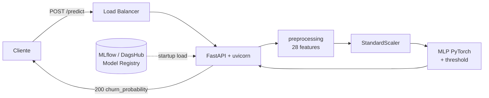

# fiap-mlet-challenge-fase-1

[](https://app.codecov.io/gh/JosueJNLui/fiap-mlet-challenge-fase-1)

Previsão de churn de clientes com base no dataset Telco Customer Churn. API REST em FastAPI servindo o modelo MLP final (PyTorch) registrado no MLflow do DagsHub.

## Arquitetura do sistema

API estruturada em camadas (DDD enxuto):

- **`src/api/`** (Interface): rotas FastAPI (`/health`, `/predict`), schemas Pydantic, dependências.
- **`src/application/`** (Casos de uso): pré-processamento de features (replica do notebook) e `ChurnPredictor` (modelo + scaler + threshold).
- **`src/infrastructure/`** (Integrações externas): loader que busca o modelo registrado no MLflow do DagsHub e baixa o artefato `scaler.joblib` do mesmo run.
- **`src/main.py`** (Composição): `create_app()`, lifespan que carrega o modelo no startup (fail-fast), middleware de latência + logging JSON estruturado com `request_id` propagado.

Fluxo de uma predição:
1. Lifespan carrega `Churn_MLP_Final_Production` (versão pinada) e `scaler.joblib` do MLflow → `app.state.predictor`.
2. Cliente faz `POST /predict` com payload Telco bruto (21 campos menos `customerID`).
3. Pydantic valida enums e ranges (422 em caso de erro).
4. `ChurnPredictor.predict()`: preprocessing → scaler → tensor PyTorch → sigmoid → threshold (0.20303, otimizado em curva PR de negócio).
5. Resposta inclui `churn_probability`, `prediction`, `threshold`, `model_version`, `request_id`.



📚 **Documentação operacional:**
- [`docs/MODEL_CARD.md`](docs/MODEL_CARD.md) — performance, vieses, limitações, cenários de falha.
- [`docs/ARCHITECTURE_DEPLOY.md`](docs/ARCHITECTURE_DEPLOY.md) — decisão real-time, SLA, scaling, DR.
- [`docs/DEPLOYMENT.md`](docs/DEPLOYMENT.md) — arquitetura prática de deploy com Helm/Kubernetes e Terraform/AWS ECS.
- [`docs/MONITORING.md`](docs/MONITORING.md) — métricas técnicas/modelo/negócio, alertas, playbook.
- [`docs/CONTRIBUTING.md`](docs/CONTRIBUTING.md) — fluxo TBD, Conventional Commits, SemVer.
- [`docs/CODE_GUIDELINES.md`](docs/CODE_GUIDELINES.md) — diretrizes de DDD, Clean Code e stack Python.

🧪 **Notebooks de pesquisa** (FIAP MLET Fase 1):
- `notebooks/eda.ipynb` cobre a **Etapa 1** (EDA + baselines DummyClassifier/Logistic Regression) e escreve no experimento MLflow `Churn-Predict-Telco-Etapa1-EDA`.
- `notebooks/modeling.ipynb` cobre a **Etapa 2** (MLP em PyTorch + ensembles, grid search, K-Fold, threshold otimizado, análise de trade-off FP×FN) e escreve em `Churn-Predict-Telco-Etapa2-Modelagem`.
- `notebooks/models-comparison.ipynb` consulta os **dois** experimentos para a comparação cruzada.
- Cálculos de lucro e custo de erro vivem em [`src/application/business_metrics.py`](src/application/business_metrics.py) — single source of truth compartilhada pelos três notebooks e pelo Model Card.

## Documentação interativa (Swagger / OpenAPI)

Com a API rodando, abra um dos endpoints abaixo no browser:

| URL | Descrição |
|---|---|
| <http://localhost:8000/docs> | Swagger UI — testar endpoints direto do browser (`Try it out`) |
| <http://localhost:8000/redoc> | ReDoc — documentação narrativa, ideal para leitura |
| <http://localhost:8000/openapi.json> | Spec OpenAPI 3.1 bruto, p/ gerar clientes (openapi-generator, etc.) |

Cada endpoint expõe `summary`, `description`, exemplos completos de payload e respostas, e modelos documentados para os erros `422` (validação) e `503` (modelo não carregado). Em produção, defina `DOCS_URL=` (vazio) no ambiente para desabilitar a UI sem alterar código.

## Endpoints

### `GET /health`
Retorna `{"status":"ok","timestamp":"...Z"}` com headers `X-Process-Time` e `X-Request-ID`.

### `POST /predict`

Recebe um payload Telco bruto (21 campos do dataset, menos `customerID`) e retorna a probabilidade de churn aplicando o pré-processamento + scaler + threshold de negócio.

Exemplo com `curl`:

```bash
curl -X POST http://localhost:8000/predict \
  -H 'Content-Type: application/json' \
  -d '{
    "gender": "Female",
    "SeniorCitizen": 0,
    "Partner": "Yes",
    "Dependents": "No",
    "tenure": 24,
    "PhoneService": "Yes",
    "MultipleLines": "No",
    "InternetService": "DSL",
    "OnlineSecurity": "Yes",
    "OnlineBackup": "No",
    "DeviceProtection": "No",
    "TechSupport": "Yes",
    "StreamingTV": "No",
    "StreamingMovies": "No",
    "Contract": "One year",
    "PaperlessBilling": "Yes",
    "PaymentMethod": "Electronic check",
    "MonthlyCharges": 75.5,
    "TotalCharges": 1850.0
  }'
```

Resposta (200):
```json
{
  "churn_probability": 0.42,
  "prediction": false,
  "threshold": 0.20303030303030303,
  "model_version": "8",
  "request_id": "9f4a..."
}
```

Para rastrear uma chamada específica nos logs, envie um `X-Request-ID` próprio — ele é ecoado no body e nos headers da resposta:

```bash
curl -X POST http://localhost:8000/predict \
  -H 'Content-Type: application/json' \
  -H 'X-Request-ID: my-trace-id-123' \
  -d @payload.json
```

Erros de validação retornam `422` (ex.: `Contract` fora dos enums permitidos, `tenure` negativo).

## Configuração

A API lê variáveis de ambiente (ou `.env` local). Há um template versionado no repo — basta copiar e preencher:

```bash
cp .env.example .env
```

Depois edite `.env` e configure suas credenciais do DagsHub:

- `MLFLOW_TRACKING_USERNAME`: seu usuário do DagsHub (o token só autentica como o dono dele — não use o usuário de outra pessoa).
- `MLFLOW_TRACKING_PASSWORD`: seu access token, gerado em <https://dagshub.com/user/settings/tokens>.

O arquivo `.env` está no `.gitignore`, então o token não será commitado.

Variáveis disponíveis:

| Variável | Descrição | Default |
|---|---|---|
| `MLFLOW_TRACKING_USERNAME` | Seu usuário DagsHub | — (obrigatório) |
| `MLFLOW_TRACKING_PASSWORD` | Seu token DagsHub | — (obrigatório) |
| `MLFLOW_TRACKING_URI` | URI do MLflow no DagsHub | `https://dagshub.com/JosueJNLui/fiap-mlet-challenge-fase-1.mlflow` |
| `MODEL_NAME` | Nome do modelo registrado | `Churn_MLP_Final_Production` |
| `MODEL_VERSION` | Versão pinada (recomendado) | `8` |
| `PREDICTION_THRESHOLD` | Limiar de decisão | `0.20303030303030303` |
| `LOAD_MODEL_ON_STARTUP` | Se falso, pula carregamento (debug/dev) | `true` |

Sem credenciais válidas o startup falha por design (fail-fast com 401 do DagsHub).

## Como executar

### Local (com `uv`)
```bash
make install-dev
export MLFLOW_TRACKING_PASSWORD=<seu-token-dagshub>
make run
# em outro terminal
curl http://localhost:8000/health
curl -X POST http://localhost:8000/predict -H 'Content-Type: application/json' -d @payload.json
```

### Docker
```bash
make docker-build
docker run --rm -e MLFLOW_TRACKING_PASSWORD=$TOKEN -p 8000:8000 fiap-mlet-challenge-fase-1:latest
```

A imagem usa `mlflow-skinny` + `torch+cpu`, pesa ~1GB (vs ~3.5GB com defaults).

## Como testar

```bash
make test             # suíte pytest hermética (não exige DagsHub)
make test-e2e-httpie  # E2E isolado com HTTPie contra servidor localhost
make test-cov         # testes + coverage.xml/htmlcov para Codecov
make lint             # ruff
make type-check       # ty
make check            # tudo + format check
```

Testes unitários/API usam `dependency_overrides` do FastAPI para injetar um
`FakePredictor`, então não precisam de credenciais nem rede.

O alvo `make test-e2e-httpie` executa `tests/e2e/test_httpie_api.py`: ele sobe
um `uvicorn` local com predictor determinístico e chama a API de fora do
processo usando HTTPie. A suíte cobre `/health`, `/predict` com payload válido,
border cases do payload Telco, erros comuns de parâmetros incorretos (`422`),
JSON malformado, método não permitido (`405`) e rota inexistente (`404`).

Para inspecionar status, headers e bodies de cada chamada:

```bash
E2E_HTTP_DEBUG=1 uv run pytest -s tests/e2e/test_httpie_api.py -q
```

### Cobertura com Codecov

A pipeline de CI executa `make test-cov` em todo `pull_request`, gera `coverage.xml` com `pytest-cov` e envia o relatório para o [Codecov](https://app.codecov.io/gh/JosueJNLui/fiap-mlet-challenge-fase-1) usando `codecov/codecov-action@v5`.

Para habilitar o upload no GitHub Actions, primeiro ative o repositório `JosueJNLui/fiap-mlet-challenge-fase-1` no [Codecov](https://app.codecov.io/gh/JosueJNLui/fiap-mlet-challenge-fase-1). Depois copie o token desse mesmo repositório e cadastre o segredo `CODECOV_TOKEN` em `Settings > Secrets and variables > Actions`.

Se o upload falhar com `Repository not found`, o relatório foi gerado, mas o Codecov não encontrou um repositório ativo para o token/slug usado. Revise se o repositório está habilitado no Codecov e se o `CODECOV_TOKEN` pertence exatamente a `JosueJNLui/fiap-mlet-challenge-fase-1`. O arquivo `codecov.yml` configura os status checks de projeto e patch com tolerância de 1% para pequenas variações de cobertura.

## Estrutura do repositório
```
├── data/
│   └── dataset/          # dataset original (Telco Customer Churn)
├── docs/                 # MODEL_CARD, ARCHITECTURE_DEPLOY, MONITORING, DEPLOYMENT, CONTRIBUTING, CODE_GUIDELINES
├── deploy/               # Helm/Kubernetes, Terraform/AWS ECS
├── notebooks/
│   ├── eda.ipynb              # Etapa 1: EDA + baselines (Dummy, LogReg) + MLflow
│   ├── modeling.ipynb         # Etapa 2: MLP PyTorch + ensembles + grid search + MLflow
│   └── models-comparison.ipynb # Etapas 1+2: comparação cross-experimento, trade-off, ranking
├── src/
│   ├── main.py                # create_app() + lifespan + middleware
│   ├── config.py              # Settings (pydantic-settings)
│   ├── api/                   # schemas, routes, dependencies
│   ├── application/           # preprocessing, ChurnPredictor, business_metrics
│   └── infrastructure/        # mlflow_loader (DagsHub)
├── tests/
│   ├── test_health_endpoint.py
│   ├── test_predict_endpoint.py
│   ├── application/      # preprocessing, predictor
│   └── integration/      # MLflow real (skipados por padrão)
├── Dockerfile
├── Makefile
├── pyproject.toml
└── uv.lock
```

## Stack

- Python 3.13, FastAPI, Pydantic v2, pydantic-settings
- PyTorch (CPU), scikit-learn, pandas, numpy, joblib
- MLflow-skinny client (DagsHub remoto)
- `uv` para deps, `ruff` lint+format, `ty` type-check, `pytest` testes
- Docker (`python:3.13-slim` + `uv`)

Diretrizes detalhadas em [`docs/CODE_GUIDELINES.md`](docs/CODE_GUIDELINES.md) (DDD, Clean Code, Python).

## Sobre o projeto

| Item | Detalhe |
|------|---------|
| Curso | FIAP — Machine Learning Engineering |
| Fase | 1 |
| Dataset | [Telco Customer Churn — Kaggle](https://www.kaggle.com/datasets/blastchar/telco-customer-churn) |
