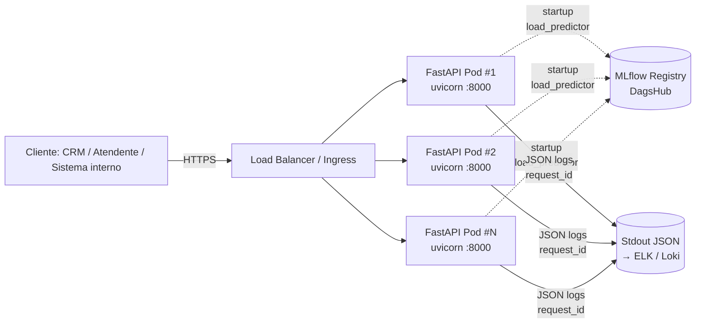
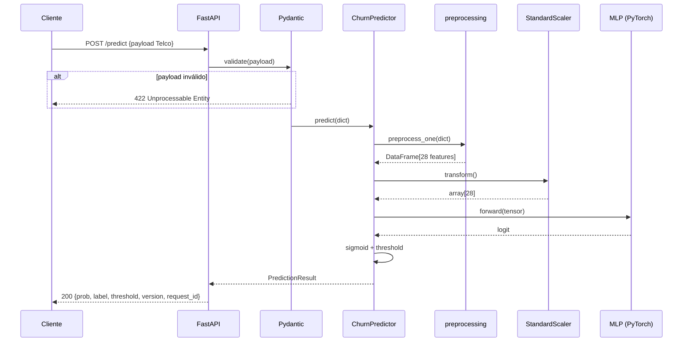
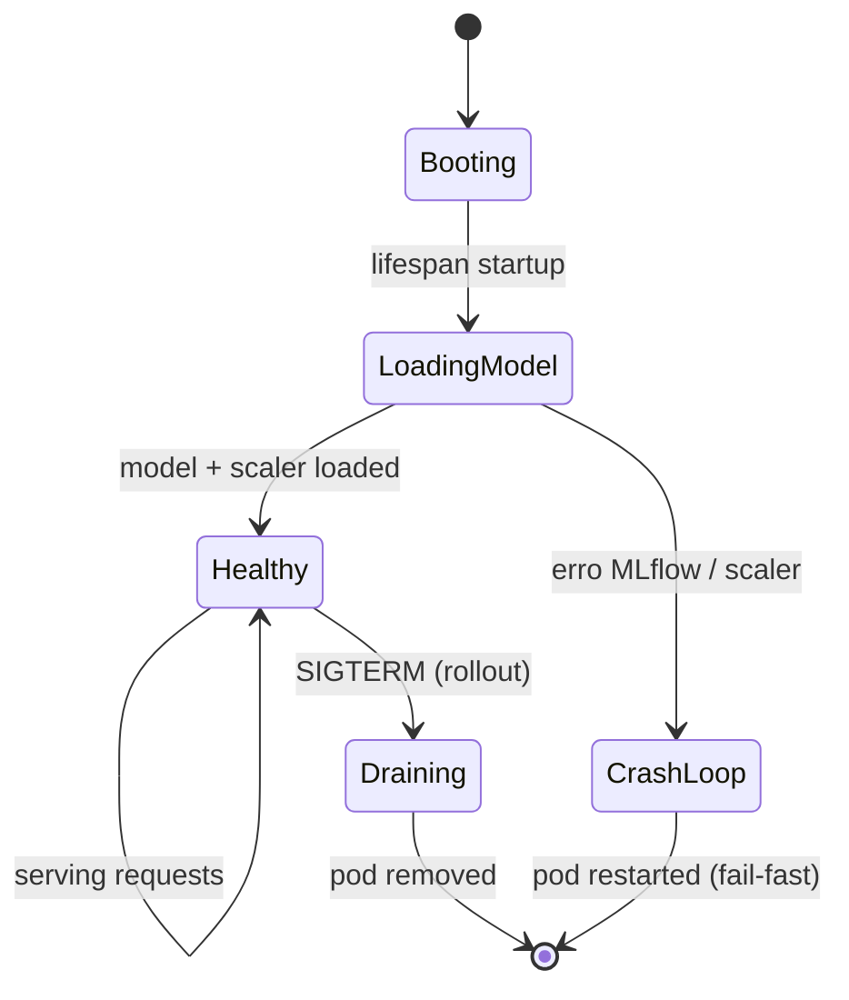

# Arquitetura de Deploy

> Decisão arquitetural, justificativa e estratégia operacional para servir o modelo de predição de churn em produção.

## 1. Decisão: Real-time via API REST

**Escolha:** servir o modelo como **microserviço HTTP (FastAPI + uvicorn)** rodando em container Docker, com inferência sob demanda (`POST /predict`).

### Justificativa (vs. batch)

| Critério | Real-time (escolhido) | Batch (descartado) |
|---|---|---|
| Caso de uso primário | Atendente em call vê o score do cliente na hora; CRM consulta sob demanda quando ticket é aberto | Lista diária pré-computada |
| Latência aceitável | < 200ms p95 | Horas |
| Frescor do score | Score reflete os dados mais recentes do cliente passados no payload | Score "envelhece" durante o dia |
| Volume esperado | Baixo a moderado (dezenas/centenas de req/s) — modelo leve roda confortável em CPU | Alto (todos os clientes em janela) — também viável, mas não é o padrão de uso |
| Custo operacional | Container leve, scaling horizontal simples | Pipeline ETL + storage + orquestração |
| Integração com CRM/atendimento | HTTP é universal | Exige acoplamento com data lake |

**Conclusão:** o uso primário é **consulta interativa** disparada por evento (atendente, ticket, campanha proativa). Real-time elimina staleness e simplifica a integração. Para casos de **score em massa** (ex.: campanha mensal cobrindo toda a base), o mesmo container pode ser invocado em modo *fan-out* a partir de um job batch — mas o serviço primário é online.

### Alternativas avaliadas e descartadas

- **Batch diário pré-computado** — descartado: staleness inaceitável quando cliente acabou de mudar de plano ou abrir ticket.
- **Streaming (Kafka + Flink/Faust)** — descartado: overhead injustificado para o volume esperado e o caso de uso. Reabrir se chegarmos a >5k req/s sustentados.
- **Serverless (AWS Lambda / Cloud Functions)** — descartável, mas o cold start do PyTorch (~2-3s para carregar `torch` + scaler) é proibitivo para SLA de 200ms. Container com modelo já carregado em memória vence.

---

## 2. Diagrama de Componentes

### Fluxo interno de uma predição

---

## 3. Componentes e Tecnologias

| Camada | Tecnologia | Justificativa |
|---|---|---|
| API | FastAPI 0.136+ | Async-first, OpenAPI nativo, Pydantic v2 integrado |
| Validação | Pydantic v2 | Schema-first, valida enums/ranges automaticamente |
| Servidor | uvicorn | ASGI padrão, integra bem com workers e Kubernetes |
| Modelo | PyTorch CPU | MLP leve, não justifica GPU; índice `pytorch-cpu` no `pyproject.toml` reduz imagem |
| Pré-processamento | sklearn `StandardScaler` + transformações custom | Reprodutível, single source of truth em `EXPECTED_FEATURE_ORDER` |
| Registry | MLflow + DagsHub | Versionamento de modelo + scaler como artefato no mesmo run |
| Container | `python:3.13-slim` + `uv sync --frozen --no-dev` | ~1GB final (vs ~3.5GB defaults) |
| Logs | JSON estruturado em stdout | Compatível com qualquer collector (ELK, Loki, CloudWatch) |
| Observabilidade | Middleware custom: `X-Process-Time`, `X-Request-ID` | Sem dependência adicional para latência básica |

---

## 4. SLOs e SLA Propostos

| Indicador | Alvo | Janela | Como medir |
|---|---|---|---|
| Latência p95 `/predict` | < 200ms | rolling 7d | `X-Process-Time` agregado |
| Latência p99 `/predict` | < 500ms | rolling 7d | idem |
| Disponibilidade | ≥ 99.5% | mensal | uptime do `/health` |
| Taxa de erro 5xx | < 0.5% | rolling 24h | logs JSON |
| Taxa de erro 4xx (validação) | informacional | — | sinal de cliente mal-formado |
| RTO (recovery time objective) | < 5 min | — | rollback de versão via env var |
| RPO (recovery point objective) | 0 (stateless) | — | API não persiste estado |

> Os SLOs estão dimensionados para o caso de uso atual (uso interno, dezenas a centenas de req/s). Renegociar em escala maior.

---

## 5. Ciclo de Vida do Modelo no Pod

- **Fail-fast no startup:** se `load_predictor()` falhar (MLflow inacessível, versão removida, scaler ausente), o lifespan levanta exceção e o pod entra em CrashLoop. Kubernetes/Docker isso é detectado pelo readiness probe e o pod **não** é incluído no Service.
- **Singleton em memória:** modelo carregado uma vez por pod em `app.state.predictor`. Cada request reusa via `Depends(get_predictor)`.
- **Refresh de modelo:** **redeploy** com nova `MODEL_VERSION` (declarativo). Sem hot-reload — preferimos rollouts canários a swaps em runtime.

---

## 6. Estratégia de Scaling

- **Horizontal:** API é stateless. Aumentar réplicas atrás do Load Balancer.
  - Dimensionar por `CPU > 70%` ou `latência p95 > 150ms`.
  - Cada pod consome ~300MB de RAM (PyTorch + modelo carregado).
- **Vertical:** desnecessário para o modelo atual (MLP de 8 neurônios).
- **Modelo carregado em memória por pod:** evita rede crítica em hot path.
- **Cold start:** ~3-5s (PyTorch import + load do MLflow). Mitigado por:
  - Readiness probe só responde após `lifespan` concluir.
  - Pre-warm em rollouts (Kubernetes `minReadySeconds`).

### Limites operacionais antes de revisar a arquitetura

| Métrica | Limite | Próximo passo |
|---|---|---|
| Throughput sustentado | > 5k req/s | Avaliar gRPC + protobuf |
| Latência p99 cresce > 1s | — | Avaliar batch micro-batching ou GPU |
| Modelo cresce > 100MB | — | Avaliar TorchServe ou KServe |

---

## 7. Disaster Recovery

| Cenário | Resposta |
|---|---|
| **DagsHub fora do ar no startup** | Pod entra em CrashLoop. Solução: imagem com fallback embutindo o modelo (deploy "self-contained"); mitigação imediata via `LOAD_MODEL_ON_STARTUP=false` (não recomendado em prod) |
| **Versão pinada removida do registry** | Mesma resposta acima. Sempre manter versão `+1` em staging antes de remover a anterior |
| **Modelo retorna scores degenerados (drift)** | Rollback via env var `MODEL_VERSION=<anterior>` + redeploy. Tempo de rollback ≈ 2 min em pipeline normal |
| **Pod não responde / health falha** | Liveness probe reinicia automaticamente |
| **DDoS / spike de tráfego** | LB com rate limiting + autoscaling agressivo; em último caso, ativar feature flag para retornar score "neutro" baseado em regras |

---

## 8. Configuração via Variáveis de Ambiente

Toda configuração é externalizada (12-factor). Defaults em `src/config.py`. Variáveis principais:

| Variável | Propósito |
|---|---|
| `MLFLOW_TRACKING_URI` | Endpoint do MLflow (DagsHub por padrão) |
| `MLFLOW_TRACKING_USERNAME` / `_PASSWORD` | Credenciais (SecretStr, nunca logadas) |
| `MODEL_NAME` / `MODEL_VERSION` | Pinning determinístico — **sempre fixar `MODEL_VERSION` em produção** |
| `PREDICTION_THRESHOLD` | Threshold de negócio (default `0.20303030303030303`) |
| `LOAD_MODEL_ON_STARTUP` | `false` apenas para dev/debug |
| `DOCS_URL` | Vazio em prod para desabilitar Swagger sem alterar código |

---

## 9. Custos Operacionais (estimativa)

Para um deploy mínimo (2 pods em qualquer Kubernetes managed ou Cloud Run-like):

| Item | Estimativa mensal |
|---|---|
| Compute (2 réplicas, 0.5 vCPU + 512MB) | ~US$ 15-30 |
| Egress (logs + DagsHub pulls) | ~US$ 5 |
| MLflow (DagsHub free tier) | US$ 0 |
| **Total** | **~US$ 20-35/mês** |

---

## 10. Documentos Relacionados

- [`../deploy/README.md`](../deploy/README.md) — guia prático de deploy com diagramas para Helm/Kubernetes e Terraform/AWS ECS.
- [`MODEL_CARD.md`](MODEL_CARD.md) — performance, vieses, limitações, cenários de falha.
- [`MONITORING.md`](MONITORING.md) — métricas, SLOs operacionais, alertas, playbook.
- [`../README.md`](../README.md) — instruções de setup e uso.
