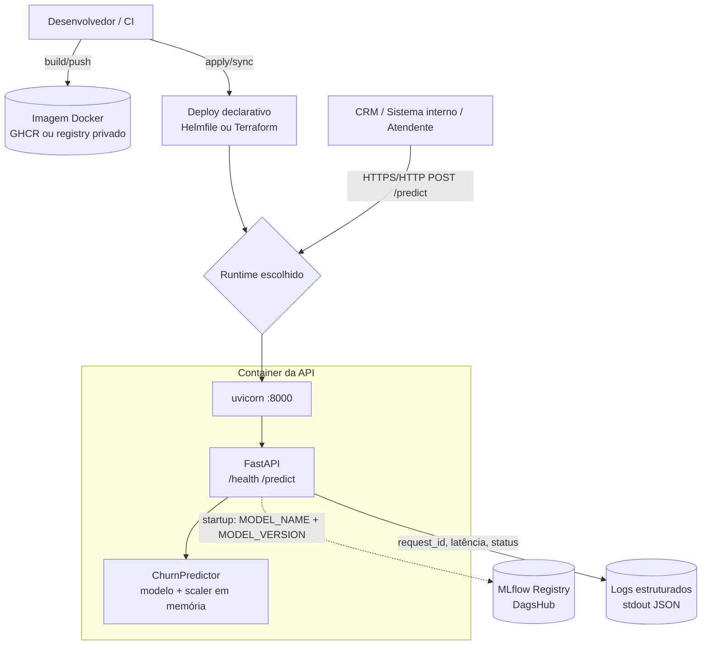
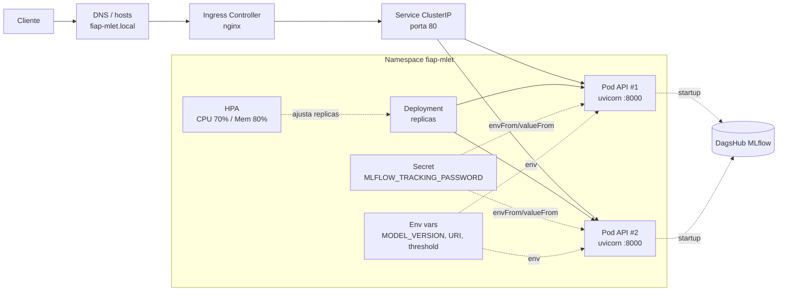
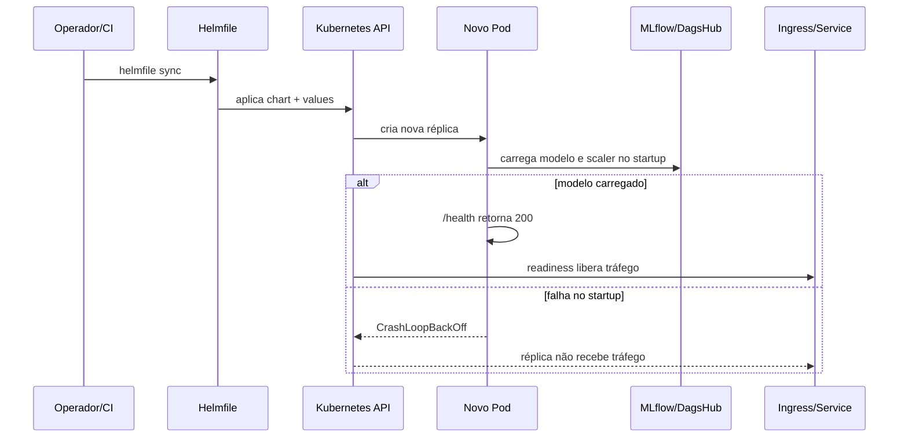
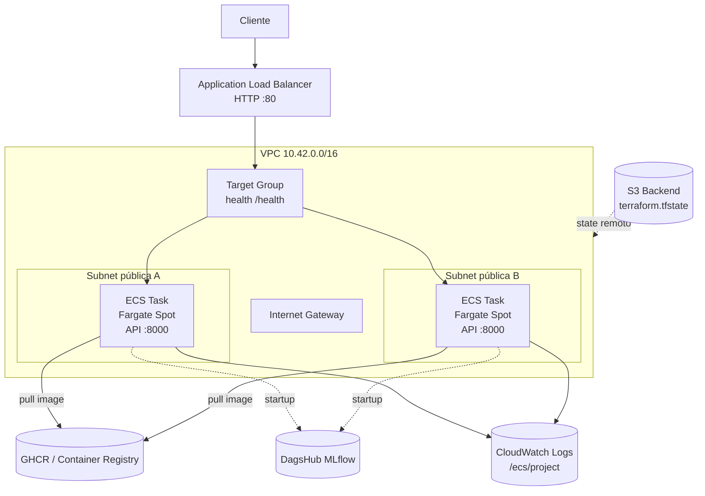
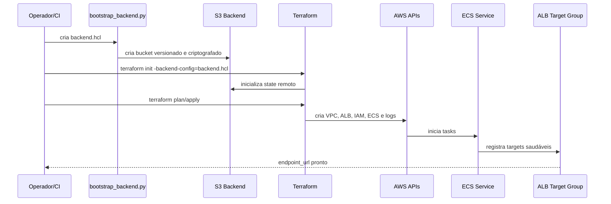
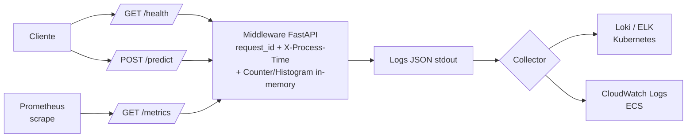

# Deploy

Documentação operacional da camada de deploy da API de churn. O código de
infraestrutura vive em [`../deploy/`](../deploy/) e suporta duas estratégias:

- **Kubernetes com Helm/Helmfile**: caminho portátil para clusters locais ou
  managed Kubernetes.
- **AWS ECS com Terraform**: caminho cloud de baixo custo usando ECS Fargate
  Spot, Application Load Balancer e CloudWatch Logs.

Para a decisão arquitetural do serviço online, SLOs, scaling e disaster
recovery, veja também [`ARCHITECTURE_DEPLOY.md`](ARCHITECTURE_DEPLOY.md).

## Visão Geral da Arquitetura



O hot path de predição não depende do MLflow. O modelo e o scaler são baixados
no startup do processo e ficam carregados em memória dentro de cada réplica ou
task. Se o carregamento falhar, o container falha cedo e não deve receber
tráfego.

## Opções de Deploy

| Opção | Pasta | Quando usar | Entrada pública | Scaling | Logs |
|---|---|---|---|---|---|
| Kubernetes | [`../deploy/helm-chart/`](../deploy/helm-chart/) + [`../deploy/helmfile.yaml`](../deploy/helmfile.yaml) | Cluster Kubernetes local, EKS, GKE, AKS ou similar | Ingress NGINX | ReplicaSet e HPA | stdout coletado pelo cluster |
| AWS ECS | [`../deploy/terraform/`](../deploy/terraform/) | Deploy simples e barato em AWS sem operar Kubernetes | Application Load Balancer | `desired_count` do ECS | CloudWatch Log Group |

## Kubernetes com Helm

O chart Helm define os recursos necessários para executar a API em Kubernetes:

- `Deployment` com container da API, variáveis de ambiente e probes.
- `Service` `ClusterIP` expondo a porta 80 para o cluster.
- `Ingress` opcional, configurado por padrão para `fiap-mlet.local`.
- `Secret` para `MLFLOW_TRACKING_PASSWORD`.
- `ServiceAccount`.
- `HorizontalPodAutoscaler` quando `autoscaling.enabled=true`.

### Diagrama Kubernetes



### Fluxo de rollout no Kubernetes



### Comandos principais

Renderizar manifestos localmente:

```bash
helm template fiap-mlet ./deploy/helm-chart
```

Aplicar via Helmfile:

```bash
cd deploy
helmfile sync
```

Verificar saúde:

```bash
kubectl -n fiap-mlet get pods
kubectl -n fiap-mlet port-forward svc/fiap-mlet 8000:80
curl http://localhost:8000/health
```

### Configuração relevante

Os defaults ficam em [`../deploy/helm-chart/values.yaml`](../deploy/helm-chart/values.yaml), e o
[`../deploy/helmfile.yaml`](../deploy/helmfile.yaml) sobrescreve valores para o release `fiap-mlet`.

| Chave | Função |
|---|---|
| `image.repository` / `image.tag` | Imagem Docker publicada no registry |
| `replicaCount` | Número fixo de réplicas quando HPA está desativado |
| `autoscaling.enabled` | Ativa/desativa HPA |
| `startupProbe` | Dá tempo para baixar e carregar o modelo do MLflow no startup |
| `readinessProbe` | Remove o pod do tráfego quando `/health` não responde |
| `livenessProbe` | Reinicia o container se a API travar |
| `env.MODEL_VERSION` | Versão pinada do modelo em produção |
| `secretEnv.values.MLFLOW_TRACKING_PASSWORD` | Token sensível do DagsHub/MLflow |

## AWS ECS com Terraform

O Terraform cria uma stack AWS simples e econômica para a API:

- VPC `10.42.0.0/16` com duas subnets públicas.
- Internet Gateway e rotas públicas.
- Security Group público para o ALB na porta 80.
- Security Group das tasks aceitando tráfego apenas do ALB.
- ECS Cluster com capacity provider `FARGATE_SPOT`.
- ECS Service com `desired_count` configurável.
- Task Definition `awsvpc`, CPU/memória configuráveis e health check local.
- Application Load Balancer HTTP.
- CloudWatch Log Group com retenção de 7 dias.
- Backend remoto S3 opcional para o state do Terraform.

### Diagrama AWS ECS



As tasks recebem IP público para evitar NAT Gateway e reduzir custo. Isso
permite baixar a imagem do registry e acessar o MLflow/DagsHub diretamente. O
Security Group ainda restringe a entrada da aplicação ao ALB.

### Fluxo de provisionamento AWS



### Comandos principais

Criar backend remoto de state na primeira execução:

```bash
cd deploy/terraform
python3 scripts/bootstrap_backend.py
```

Planejar e aplicar:

```bash
terraform init -backend-config=backend.hcl
terraform plan
terraform apply
```

Testar o endpoint:

```bash
curl "$(terraform output -raw endpoint_url)/health"
```

Mais detalhes ficam em [`../deploy/terraform/README.md`](../deploy/terraform/README.md).

## Variáveis de Ambiente da Aplicação

As duas opções de deploy configuram a aplicação por variáveis de ambiente,
mantendo a imagem Docker imutável.

| Variável | Exemplo | Observação |
|---|---|---|
| `MLFLOW_TRACKING_URI` | `https://dagshub.com/...mlflow` | Registry remoto do DagsHub |
| `MLFLOW_TRACKING_USERNAME` | `JosueJNLui` | Usuário usado no Basic Auth quando necessário |
| `MLFLOW_TRACKING_PASSWORD` | secret | Nunca versionar em texto puro |
| `MODEL_FLAVOR` | `sklearn` | **Produção:** `sklearn` (LogReg empacotada como Pipeline). `pytorch` (MLP) é alternativa A/B-testável opt-in |
| `MODEL_NAME` | `Churn_LogReg_Final_Production` | Nome registrado no MLflow. Para flavor `pytorch`, usar `Churn_MLP_Final_Production` |
| `MODEL_VERSION` | `3` | Pinning determinístico recomendado em produção (LogReg v3 servida; MLP v12 como alternativa) |
| `PREDICTION_THRESHOLD` | `0.2080` | Threshold de negócio em produção (LogReg). Para o MLP A/B usar `0.20303` |
| `LOAD_MODEL_ON_STARTUP` | `true` | Em produção deve permanecer `true` |

## Saúde, Observabilidade e Operação



Controles operacionais importantes:

- `/health` é usado por probes Kubernetes, health check do ALB e verificações
  manuais.
- `X-Request-ID` pode ser enviado pelo cliente e é propagado na resposta e nos
  logs.
- `X-Process-Time` permite agregar latência sem instrumentação adicional.
- `/metrics` expõe Counter (`fiap_mlet_http_requests_total`) e Histogram
  (`fiap_mlet_http_request_duration_seconds`) em formato Prometheus. Configure
  ServiceMonitor (Kubernetes/Prometheus Operator) ou `scrape_configs` (Prometheus
  standalone/ECS) apontando para `:8000/metrics`.
- Logs estruturados em stdout funcionam tanto no Kubernetes quanto no ECS.
- Rollback de modelo deve ser feito alterando `MODEL_VERSION` e redeployando.

## Checklist de Produção

- Publicar a imagem Docker em um registry acessível pelo runtime.
- Fixar `MODEL_VERSION`; evitar `latest` para modelo em produção.
- Configurar `MLFLOW_TRACKING_PASSWORD` como Secret, quando o registry exigir
  autenticação.
- Confirmar que `/health` fica `200` após o startup.
- Validar `POST /predict` com um payload realista antes de expor para clientes.
- Habilitar scrape de `/metrics` no Prometheus (ServiceMonitor ou
  `scrape_configs`) e confirmar que `histogram_quantile(0.95,
  rate(fiap_mlet_http_request_duration_seconds_bucket[5m]))` retorna valores
  válidos.
- Monitorar latência p95/p99, taxa de 5xx, reinícios de container e falhas de
  carregamento do modelo.
- Ter uma versão anterior do modelo conhecida para rollback rápido.
