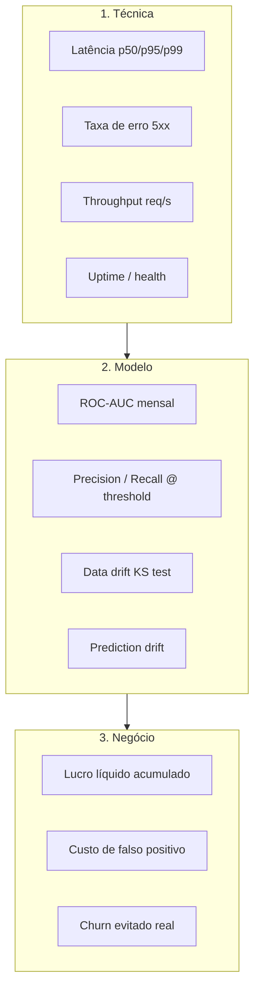

# Plano de Monitoramento

> Métricas, SLOs, alertas e playbook de resposta para a API de predição de churn.
>
> **Status atual:** este documento define o **plano**. A coleta técnica básica já está implementada — latência, `request_id`, logs JSON e **métricas Prometheus** expostas em `GET /metrics` (`src/main.py`). A coleta de métricas de modelo e negócio depende de feedback loop ainda **não implementado** (gap conhecido — ver §6).

## 1. Camadas de Monitoramento

O monitoramento é organizado em três camadas, com objetivos distintos:

---

## 2. Camada Técnica (já instrumentada)

### Métricas

| Métrica | Origem | Fonte na API |
|---|---|---|
| Latência por request (ms) | `X-Process-Time` header | middleware `latency_and_logging_middleware` |
| `request_id` | header `X-Request-ID` ou UUID gerado | middleware idem |
| Status code, path, método | log JSON estruturado | logger `fiap-mlet-challenge-fase-1` |
| Uptime | `GET /health` 200 | route `/health` |
| Eventos de modelo | log JSON: `model.loaded`, `model.load.failed` | lifespan |
| `fiap_mlet_http_requests_total{method, path, status_code}` (Counter) | `GET /metrics` (formato Prometheus) | middleware idem |
| `fiap_mlet_http_request_duration_seconds{method, path, status_code}` (Histogram) | `GET /metrics` (formato Prometheus) | middleware idem |

Logs em **stdout em JSON** já estão prontos para serem coletados por qualquer agente (Fluentd, Vector, FluentBit, CloudWatch, Loki). O endpoint `/metrics` é exposto via `prometheus-client` (instrumentação manual no middleware), em formato texto Prometheus, e fica fora do schema OpenAPI por ser operacional (`include_in_schema=False`).

### SLOs (alvos)

| SLO | Alvo | Janela | Alerta |
|---|---|---|---|
| Disponibilidade `/health` | ≥ 99.5% | mensal | < 99% em 24h |
| Latência p95 `/predict` | < 200ms | rolling 7d | > 300ms por 5min |
| Latência p99 `/predict` | < 500ms | rolling 7d | > 1s por 5min |
| Taxa de erro 5xx | < 0.5% | rolling 24h | > 1% por 10min |
| Pod healthy após startup | 100% | rolling 1h | qualquer CrashLoopBackOff |

### Stack recomendado

- **Coleta:** ✅ implementada — `prometheus-client` instrumentando o middleware,
  endpoint `/metrics` expõe Counter + Histogram. Falta apenas configurar o
  scrape no Prometheus server (ServiceMonitor no Kubernetes ou `scrape_configs`
  estático).
- **Logs:** Loki / ELK / CloudWatch parseando o JSON existente — pendente.
- **Dashboard:** Grafana com painéis derivados das métricas Prometheus
  (`histogram_quantile` para latência p95/p99, `rate()` para erro 5xx) — pendente.
- **Alertas:** Alertmanager → PagerDuty / Slack — pendente.

---

## 3. Camada de Modelo

Métricas que detectam **degradação do modelo** independente da infraestrutura.

### Data drift — KS test em features-chave

Variáveis com maior poder discriminativo identificadas em `notebooks/eda.ipynb`:

| Feature | Tipo | Teste |
|---|---|---|
| `tenure` | numérica | Kolmogorov-Smirnov vs distribuição de treino |
| `MonthlyCharges` | numérica | KS |
| `TotalCharges` (após log1p) | numérica | KS |
| `Contract` | categórica | Chi² (proporções vs treino) |
| `PaymentMethod` | categórica | Chi² |
| `InternetService` | categórica | Chi² |

**Alerta:** p-value < 0.01 em ≥ 3 das 6 features simultaneamente, em janela diária com ≥ 1k requests.

### Prediction drift

- **Métrica:** distribuição de `churn_probability` retornada (mediana, p25, p75) por dia.
- **Baseline:** distribuição em validação (mediana ~0.27, alinhada com taxa real de churn).
- **Alerta:** mediana fora de [0.18, 0.36] por 3 dias consecutivos.

### Performance (requer rótulos reais)

Reavaliação **mensal** em amostra rotulada (clientes com janela de observação completa de churn = 90 dias):

| Métrica | Baseline (hold-out) | Limite de alerta |
|---|---|---|
| ROC-AUC | 0.849 | < 0.80 |
| PR-AUC | 0.672 | < 0.60 |
| F1 (churn) | 0.560 | < 0.50 |
| Recall (churn) | 0.96 | < 0.90 |
| Precision (churn) | 0.40 | < 0.30 |

**Cálculo:** comparar predição do dia D (probabilidade ≥ threshold) com churn real em D+90.

---

## 4. Camada de Negócio

### Métricas

| Métrica | Definição | Fonte |
|---|---|---|
| Lucro líquido acumulado | `TP × R$500 − FP × R$100 − FN × R$500` | feedback loop (CRM → DW) |
| Custo de FP mensal | nº FP × R$ 100 | idem |
| Churn evitado | nº TP × R$ 500 (ações de retenção bem-sucedidas) | idem |
| Cobertura de campanha | predições com label=`true` por mês | API logs |

### SLOs de negócio

| SLO | Alvo | Alerta |
|---|---|---|
| Lucro líquido mensal | > R$ 50.000 | negativo por 2 meses consecutivos |
| ROI vs custo retenção | > 3x | < 1.5x em 2 meses |
| Taxa de captura de churners | ≥ 80% | < 70% por mês |

> **Pré-requisito:** feedback loop (sair do CRM) **ainda não implementado**. Ver §6.

---

## 5. Alertas e Severidades

| Severidade | Critério | Canal | Tempo de resposta |
|---|---|---|---|
| **P1 — crítico** | API indisponível, taxa 5xx > 5%, modelo retorna NaN/erro | PagerDuty | < 15 min |
| **P2 — alto** | Latência p95 > 300ms, ROC-AUC abaixo de baseline, drift em ≥3 features | Slack `#ml-ops` | < 1h |
| **P3 — médio** | Drift parcial (1-2 features), prediction drift, lucro mensal abaixo do alvo | Slack `#ml-ops` | < 1 dia |
| **P4 — info** | Mudanças notáveis sem ação imediata (novos enums, primeiro alerta de drift) | Email semanal | revisão de rotina |

---

## 6. Playbook de Resposta

### Cenário A: Latência p95 acima do alvo

1. Verificar carga (req/s) e CPU dos pods.
2. Escalar horizontalmente (mais réplicas).
3. Se persistir: investigar bottleneck — geralmente preprocessing (alocação de DataFrame por request) ou import de PyTorch (não deveria, é só forward).
4. Considerar habilitar **batch micro-batching** se throughput passar a justificar.

### Cenário B: Taxa 5xx > 1%

1. Coletar `request_id` de exemplos no log.
2. Reproduzir com payload registrado.
3. Se for falha de inferência: rollback para versão anterior (variável `MODEL_VERSION`).
4. Se for falha de infra (rede DagsHub): mitigar com cache local / fallback de modelo embutido.

### Cenário C: Drift detectado (ROC-AUC < 0.80 ou KS test p<0.01 em ≥3 features)

1. **Investigação:** abrir `notebooks/` em ambiente de análise; rodar EDA na janela atual vs. dataset original. Identificar feature(s) afetada(s).
2. **Decisão de retreino:** se drift é sazonal/transitório, monitorar mais 1-2 semanas. Se estrutural (novo produto, mudança de público), agendar retreino.
3. **Retreino:**
   - Coletar amostra recente rotulada (≥ 5k clientes com janela de 90d).
   - Rodar `notebooks/modeling.ipynb` com dados atualizados.
   - Validar via K-Fold + comparação Friedman/Nemenyi.
   - Registrar nova versão no MLflow (incrementa `MODEL_VERSION`).
   - Deploy canário (10% → 50% → 100% em rollout de 24h).

### Cenário D: Lucro líquido negativo por 2 meses

1. Recalcular custo real de FP e LTV real (podem estar desatualizados).
2. Se LTV ou custo mudaram: reotimizar threshold (sweep PR curve com novos parâmetros).
3. Deploy do novo threshold via env var `PREDICTION_THRESHOLD` (não exige retreino).

### Cenário E: Modelo carregando da versão errada

1. Confirmar `MODEL_VERSION` no `.env` / configmap.
2. Confirmar via log `model.loaded` no startup do pod.
3. Forçar rollout (kill pods).
4. Se inconsistência persiste: revisar pipeline de deploy / GitOps.

### Cenário F: DagsHub indisponível

- Curto prazo: pods existentes continuam servindo (modelo já em memória).
- Novos pods não sobem. Configurar `replicaCount` para não escalar para baixo durante incidente.
- Mitigação durável: empacotar `model.pt` + `scaler.joblib` na própria imagem como fallback (custo: imagem ~50MB maior).

---

## 7. Implementação Faseada

A camada técnica (§2) já está pronta. As demais demandam trabalho:

| Fase | Escopo | Dependências |
|---|---|---|
| **1 — Métricas técnicas (atual)** | Latência, request_id, logs JSON | ✅ implementado |
| **2a — `/metrics` Prometheus** | Counter + Histogram via `prometheus-client` no middleware | ✅ implementado |
| **2b — Scrape + Dashboards** | Prometheus server scraping `/metrics` + dashboards Grafana + Alertmanager | ServiceMonitor (k8s) ou `scrape_configs` (ECS); Grafana provisionado |
| **3 — Drift monitoring** | Job offline diário sobre logs de predição | Persistência de payloads (LGPD: anonimizar) |
| **4 — Feedback loop** | Integração CRM → DW → métricas de negócio | Acordo com time de retenção |
| **5 — Retreino automatizado** | Pipeline disparado por alerta de drift | MLflow Pipelines / Airflow / Kubeflow |

---

## 8. Documentos Relacionados

- [`MODEL_CARD.md`](MODEL_CARD.md) — performance esperada, limitações, cenários de falha.
- [`ARCHITECTURE_DEPLOY.md`](ARCHITECTURE_DEPLOY.md) — arquitetura e SLOs de infra.
- [`../README.md`](../README.md) — setup e uso da API.
